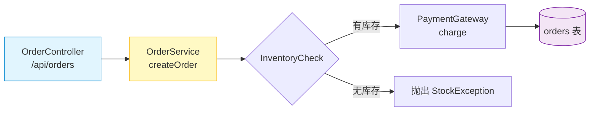

记录一下 `project-study-coach` 这个 skill 是怎么磨出来的。不是文档，就是给自己留个底。

### 起因
最开始就是想把 `ai-agents-from-zero` [传送门](https://github.com/didilili/ai-agents-from-zero)[^1]那种“边讲边跑”的教学法抽出来，做成通用 skill。不想让 AI 只写总结，而是想让它带人走通一条线：从项目背景、代码分层，到最小链路跑通、设计原理，再到怎么调试扩展。核心定位就一句话：**把陌生仓库变成能跑、能看、能讲的学习路径**。

### 几个关键迭代

1.  **从“讲”到“生成产物”**
    光在对话里讲太虚，得落地成文件。定了 `Tutorial/` 目录放学习路线、产物清单、章节教程和示例，不碰项目原 README，干净且好删改。

2.  **示例必须真能跑**
    参考了 `deepsearch-agents/examples`，要求示例聚焦单点、调真实 API、打印检查点、写清运行命令和预期信号。示例不是凑数的，是学习探针。
3.  **Java 不能照搬 Python**
    Python 一个文件就能跑，Java 不行。加了 JVM 专属规则：优先用 `*LearningTest`，复用项目测试栈，放对 module 和 package，严禁扔进 `build/target`。还补了 Maven/Gradle 单测命令，避免跑不起来。

4.  **章节要有代码+预期输出**
    教程不能只讲概念，每章都得有：运行命令、关键代码片段、预期输出、观察点。后来去掉了固定标题模板，改成观察点必须贴合当前项目（日志/状态/断言等）。

5.  **Mermaid 图要小而有用**
    加图是为了降低理解成本，不是装饰。限制 5-12 节点，图前说看什么，图后映射真实源码，不虚构组件。支持 flowchart/sequence/state/class/er 几种够用就行。

6.  **反复修细节防跑偏**
    -   codex 和 claude code(ds v4驾驶员)互相review修改skill
    -   触发描述补全 Mermaid、预期输出等关键词；
    -   默认 prompt 写完整；
    -   Java 多模块落点规则补齐；
    -   SKILL.md 快 500 行了，后续打算拆 `references/`。
    

### 能力边界
✅ 能做：读结构、生学习地图/教程/示例/JUnit 测试、加 Mermaid、写预期输出和观察点、生成产物清单，始终聚焦源码。

❌ 不做：伪装生产功能、改 CI/Docker、硬编码密钥、替换 README、假装外部服务可用。

### 几个取舍
-   `Tutorial/` 独立：和官方文档隔离，好迭代。
-   必写预期输出：不然学习者不知道“成功长什么样”。
-   注释重 why 和观察点，不复读语法。
-   Mermaid 小图更聚焦，大图反而没学习价值。

### 验证 & 后续
每次改完跑 `quick_validate.py` 验结构，但真效果还得靠实跑：Python 示例能不能执行、Java 测试能不能单独跑、链接对不对、Mermaid 渲染是否正常、预期输出是否一致。

后面还想做：拆 JVM 参考文档、加 forward-test 用例、README 加截图、搞个 fixture 项目专门验生成质量。

### 最后
这 skill 不是让 AI 堆文档，是让它当工程教练：找主线→跑最小路径→讲设计→让人能复述扩展。核心价值就是把零散文件变成一条能走通的学习路线。

