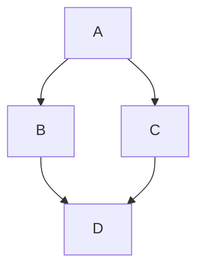

---
# ==================== 基础信息 ====================
layout: post                          # 布局类型: post(文章) | page(页面) | collection | collections
title: TypePost                       # 文章标题
date: 2025-01-30 15:46:28             # 创建日期
# updated: 2024-06-01 12:00:00         # 更新时间(可选, 不填则自动检测文件修改时间)
#author: 你的名字                      # 作者(可选, 默认取 site.config.ts 中的作者)

# ==================== 分类与标签 ====================
tags:
    - 标签1
    - 标签2                           # 可以有多个标签
categories: 分类                      # 分类, 数组形式表示多层: ["编程", "算法"]

# ==================== 封面与图标 ====================
# cover: '/posts/xxx.png'               # 封面图片(URL或本地路径)
#icon: 'i-ri-article-line'            # 标题前的图标(UnoCSS图标名)
# color: red                           # 文章卡片标题颜色(Yun主题专属)
# postTitleClass: "custom-title"       # 自定义文章列表标题CSS类(在 styles/index.scss 中写样式)

# ==================== 文章控制 ====================
top: 1                                # 置顶, 数字越大越靠前
draft: true                           # true=草稿(仅开发可见), 发布时改为 false
# hide: true                           # 隐藏文章: true=全部隐藏, 'index'=仅首页隐藏
# end: true                            # 标记完结, 末尾显示 Q.E.D.
nav: true                             # 是否显示上一篇/下一篇导航

# ==================== 时间与警告 ====================
time_warning: 30                     # 文章更新超过N天显示警告(默认30天), false=关闭

# ==================== 侧边栏与目录 ====================
# toc: true                            # 是否显示目录(默认true)
# aside: true                          # 是否显示右侧侧边栏(默认true)
# sidebar: false                       # 是否显示左侧侧边栏(默认false)
#comment: true                        # 是否显示评论区(默认true)

# ==================== 赞助与版权 ====================
#sponsor: false                       # 是否显示赞助/打赏按钮(默认取全局配置)
#copyright: false                     # 是否显示文章底部版权信息(默认取全局配置)

# ==================== 卡片类型(外链跳转) ====================
#type: bilibili                       # 卡片类型: bilibili | yuque | 其他
#url: https://www.bilibili.com/video/xxx  # 配合type使用, 点击卡片直接跳转

# ==================== 摘要控制 ====================
# excerpt: "这里是自定义摘要内容"       # 手动指定摘要(替代自动提取)
# excerpt_type: html                   # 摘要类型: html(默认) | md | text | ai

# ==================== 功能开关(单篇文章级别) ====================
#katex: false                         # KaTeX数学公式: 全局开则这里关, 反之亦然
#codepen: true                        # 启用CodePen嵌入
#medium_zoom: true                    # 启用图片缩放(medium-zoom)
#codeHeightLimit: 500                 # 限制代码块高度(px)

# ==================== 加密(极少用) ====================
# encrypt: true                        # 是否启用加密
# password: "123456"                   # 加密密码
# password_hint: "提示文字"             # 密码提示

# ==================== SEO(极少用) ====================
#ogImage: ''                          # Open Graph图片(社交媒体分享用)
#markdownClass: 'custom-md'           # 自定义Markdown容器CSS类
---

# 文章正文内容

## 容器提示

::: tip

提示内容

:::

::: warning

警告内容

:::

::: danger

危险内容

:::

::: info

信息内容

:::

::: details 点击展开

折叠内容

:::

## 数学公式

行内公式: $a \ne 0$

块级公式:

$$ x = {-b \pm \sqrt{b^2-4ac} \over 2a} $$

## 代码块

```ts[valaxy.config.ts]:line-numbers
export default defineValaxyConfig({
  // 配置内容
})
```

## Mermaid 图表



## 脚注

这是一个脚注[^1]。

使用 `^[内容]` 可以创建内联脚注^[比如这个！]。

[^1]: 这是脚注的内容。